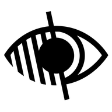

# Blind QR Scanner



A special scanner blind people can use to navigate buffet restaurants themselves

## Project setup
```
npm install
```

### Compiles and hot-reloads for development
```
npm run serve
```

### Compiles and minifies for production
```
npm run build
```
Then run
```
firebase deploy -m "optional message"
```
To the deploy the files in the "dist" folder

### Lints and fixes files
```
npm run lint
```

### Customize configuration
See [Configuration Reference](https://cli.vuejs.org/config/).
